# 智能优化算法对比分析

本项目对比分析了三种主流智能优化算法（PSO、ACO和Firefly）在四个标准测试函数（Rastrigin、Ackley、Schwefel和Rosenbrock）上的性能表现。通过分析算法的收敛速度、求解精度和参数鲁棒性，为不同场景下的算法选择提供理论依据。

## 项目结构

```
├── aco.py                 # 蚁群算法(ACO)实现
├── pso.py                 # 粒子群优化算法(PSO)实现
├── firefly.py             # 萤火虫算法(Firefly)实现
├── test_function.py       # 测试函数实现
├── main.py                # 主程序（运行所有算法对比）
    ├── main_pso           # PSO参数对比函数
    ├── main_aco           # ACO参数对比函数
    └── main_firefly       # Firefly参数对比函数
├── analysis.py            # 收敛速度、精度、鲁棒性分析函数
└── results/               # 结果输出目录
    ├── convergence/       # 收敛曲线图
    ├── accuracy/          # 精度分析图
    └── robustness/        # 鲁棒性分析图
```

## 算法参数配置

### PSO算法参数配置

| 参数 | Rastrigin | Ackley | Schwefel | Rosenbrock |
| ---- | --------- | ------ | -------- | ---------- |
| 粒子数 | 100 | 100 | 100 | 100 |
| 惯性权重 | 0.7 | 0.7 | 0.7 | 0.7 |
| 加速系数 | (2.0,1.0) | (1.5,1.5) | (2.0,1.0) | (1.5,1.5) |

### ACO算法参数配置

| 参数 | Rastrigin | Ackley | Schwefel | Rosenbrock |
| ---- | --------- | ------ | -------- | ---------- |
| 蚂蚁数 | 100 | 100 | 100 | 100 |
| (α,β,ρ) | (1.0,2.0,0.7) | (1.0,2.0,0.7) | (1.5,2.0,0.5) | (1.0,2.0,0.7) |

### Firefly算法参数配置

| 参数 | Rastrigin | Ackley | Schwefel | Rosenbrock |
| ---- | --------- | ------ | -------- | ---------- |
| 萤火虫数 | 100 | 100 | 100 | 100 |
| (β₀,γ,α) | (0.5,1.0,0.2) | (1.0,1.0,0.2) | (1.5,1.0,0.2) | (1.0,1.0,0.4) |

## 实验结果

### 结果分析

各算法在最优参数下的结果：

#### Rastrigin函数

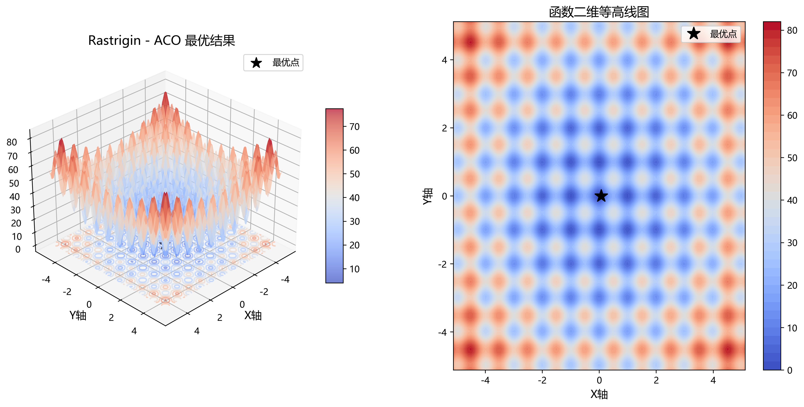


#### Ackley函数

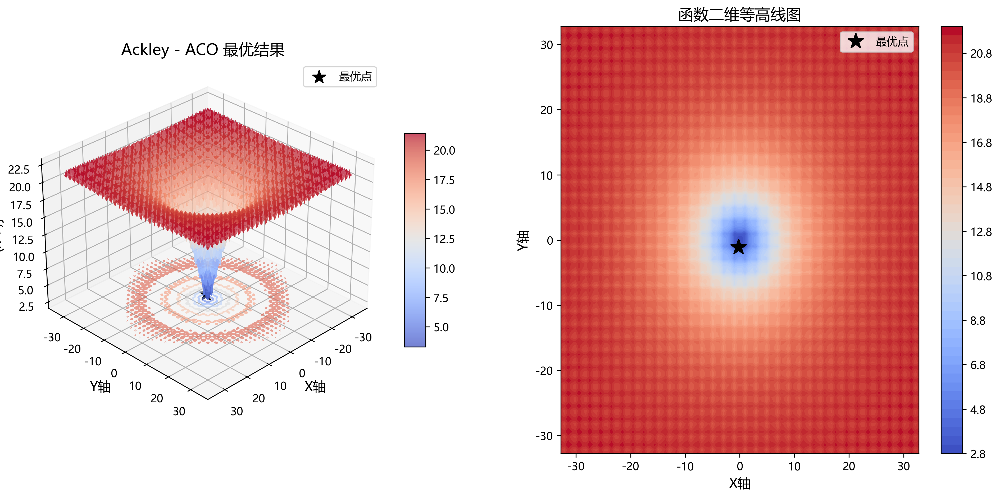
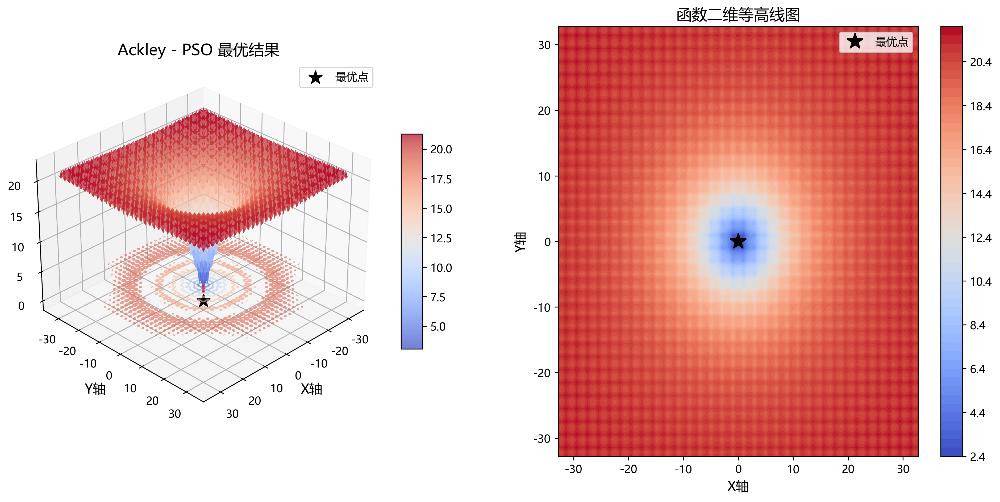
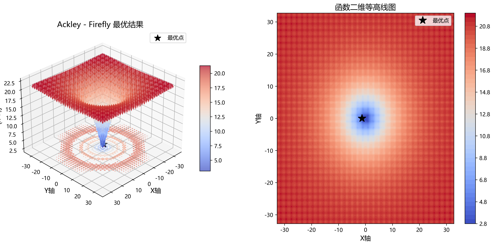

#### Schwefel函数

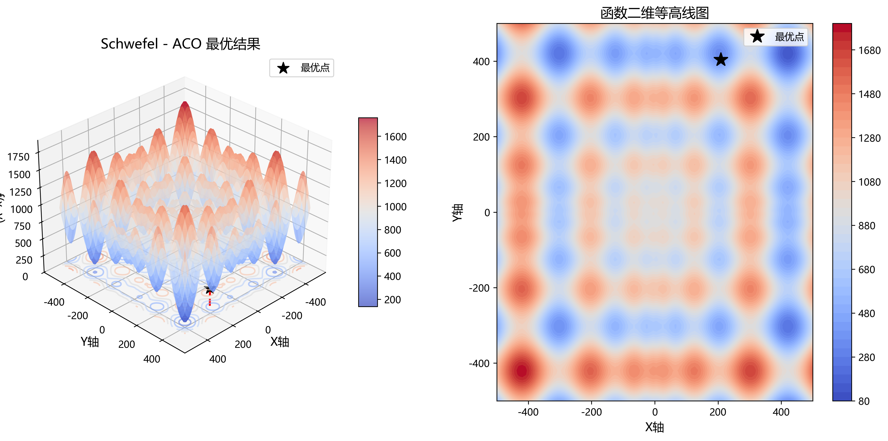
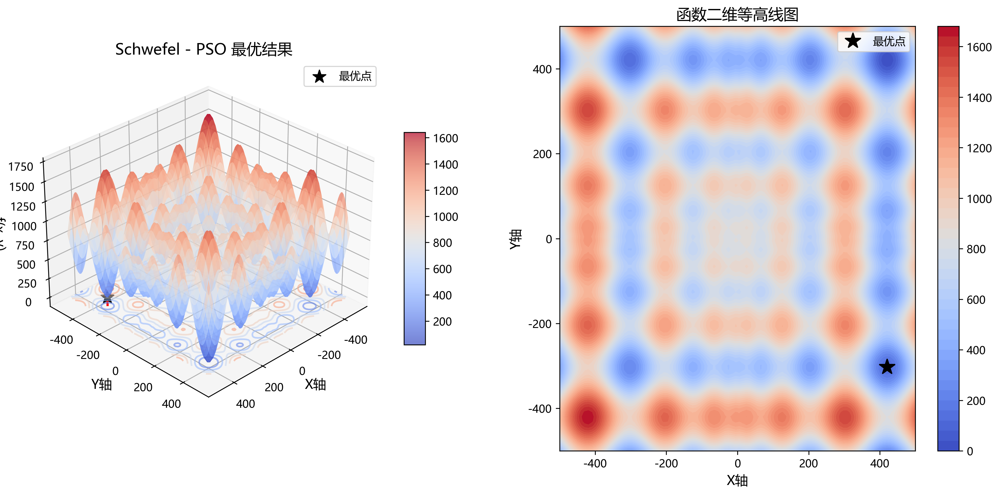
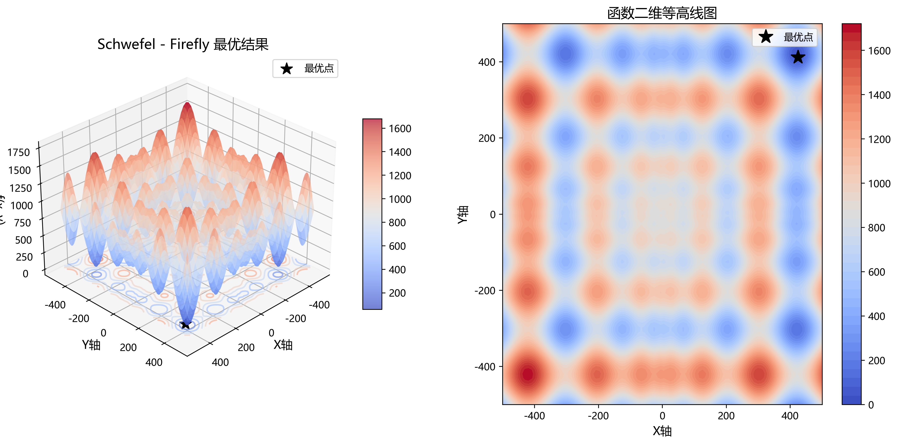

#### Rosenbrock函数


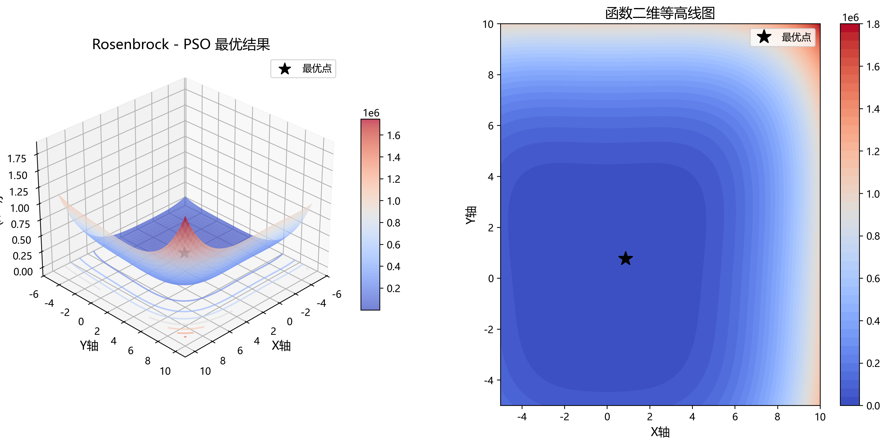


### 收敛性能比较

各算法在四个测试函数上的收敛曲线如下：

#### Rastrigin函数

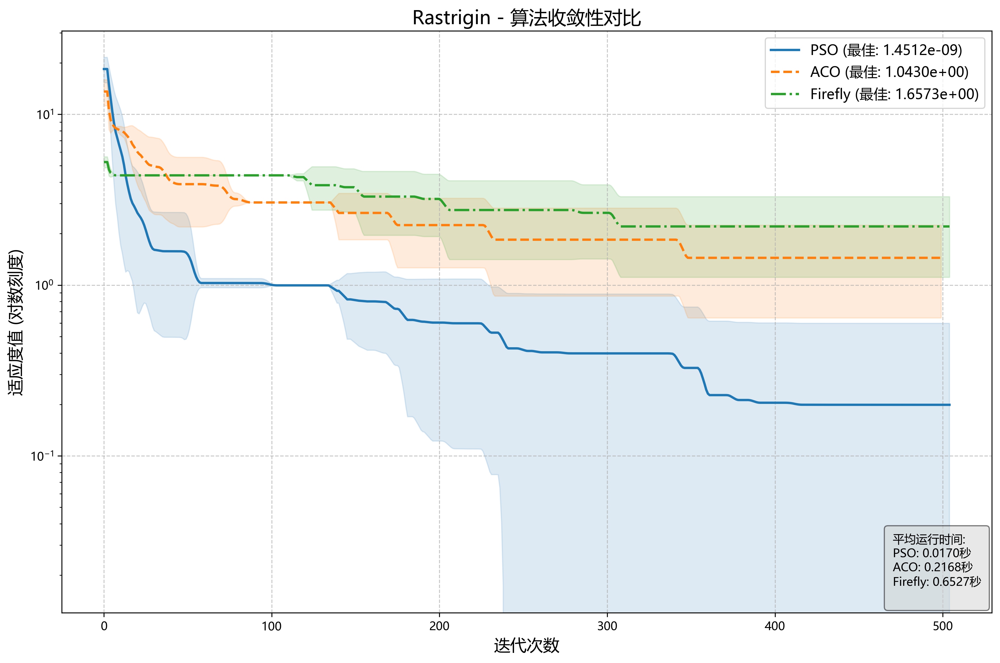

#### Ackley函数

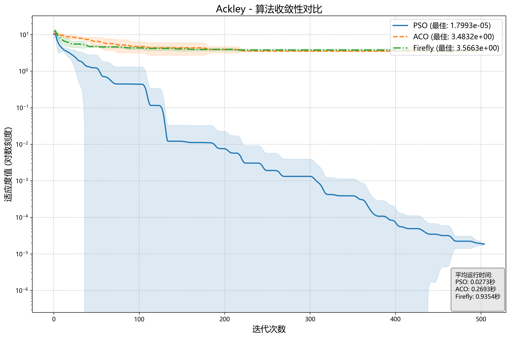

#### Schwefel函数

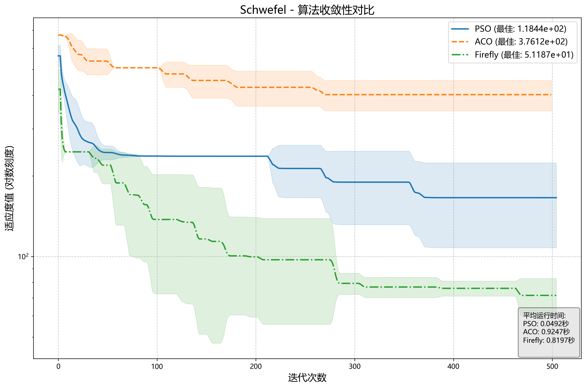

#### Rosenbrock函数

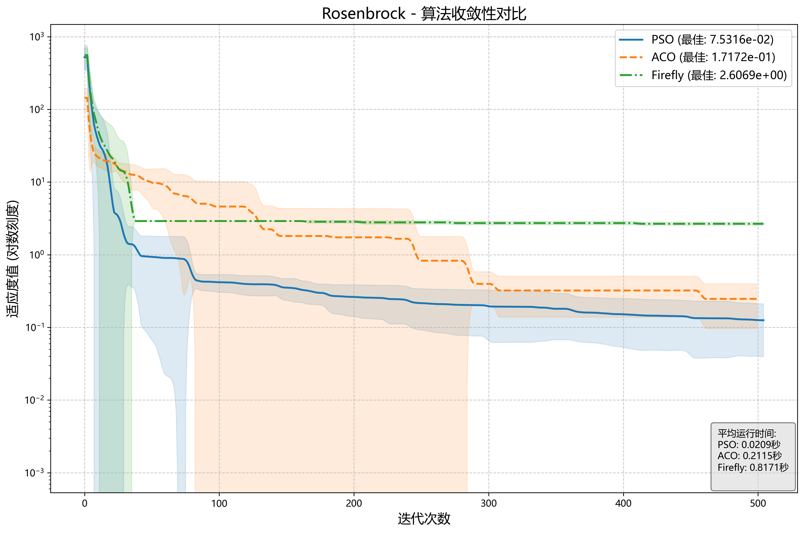


## 关键发现

1. **收敛速度**: PSO算法在所有测试函数上表现出最快的收敛速度，尤其在Ackley函数上能快速接近全局最优解。

2. **求解精度**: PSO算法获得了最高的求解精度，在Ackley函数上达到了0.00的理想值。Firefly算法精度次之，ACO算法表现较弱。

3. **鲁棒性**: Firefly算法展现出最佳的参数鲁棒性，对参数变化不敏感。PSO虽然精度高但参数敏感性也高，需要精心调参。

## 算法适用建议

- **PSO算法**: 适合对精度要求高且有充足调参时间的场景
- **Firefly算法**: 适合对算法稳定性要求高、参数调优资源有限的场景
- **ACO算法**: 更适合路径规划等组合优化问题，不建议用于高维连续函数优化

## 使用方法

1. 运行完整对比实验:
```bash
python main.py
```

2. 运行收敛性，速度，鲁棒性分析:
```bash
python analysis.py     
```


## 依赖库

- numpy
- matplotlib
- pandas
- seaborn
